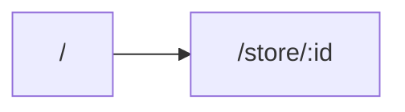

# Navigation

Blue Ocean uses Expo Router with a custom `RootLayout` (`src/layout/RootLayout.tsx`) that provides the application shell, global header, and navigation menu.

- **`/`** – home screen.
- **`/store/:id`** – store detail screen.

Additional flows such as cart and profile appear as modals or component-driven overlays instead of dedicated routes.
