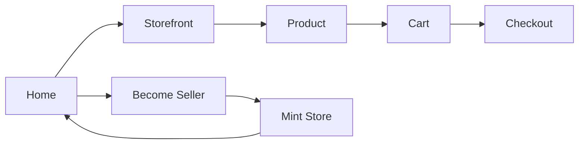

# Navigation

The diagram below shows key user flows and links to the source files for each screen or component.

## Flows

- Home → Store → Product → Cart → Checkout
- Home → Become Seller → Mint Store → Home

