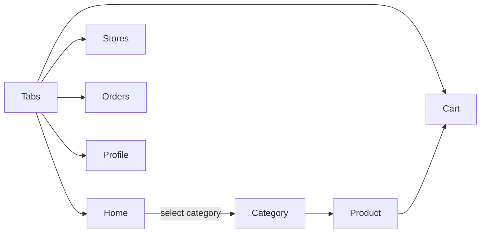

# Navigation

Blue Ocean relies on [Expo Router](https://expo.github.io/router/) and a tab layout to move between screens.
On phones the tabs appear along the bottom, while tablets and larger viewports show the same items in a fixed sidebar on the left.
The diagram below outlines the primary user flow.

- **Tabs** – implemented in `src/layout/TabsLayout.tsx`, renders the bottom navigation bar or left sidebar based on screen size.
- **Avatar Menu** – the profile avatar opens authentication actions.
- **Category** – routes like `/category/[id]` show filtered product views.

This high‑level map helps visualize how users move through the application.
