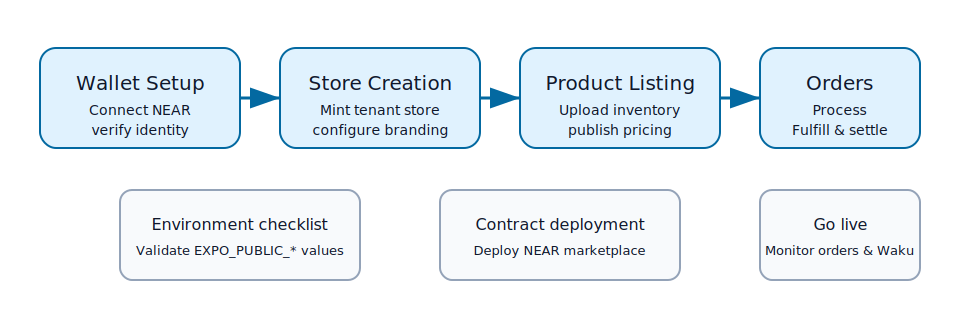

# Tenant Onboarding Guide

Give your community a working Blue Ocean storefront in a single afternoon. This guide walks tenant operators through wallet preparation, store creation, catalog publishing, and day-to-day order fulfillment.



## Audience & prerequisites

This playbook is intended for tenant administrators who manage their own NEAR accounts and control the storefront configuration. You should:

- Have access to a NEAR wallet with enough funds to pay for contract deployment and initial transactions.
- Be able to run Node.js 18+, Yarn, and the NEAR CLI from your workstation.
- Know the marketplace contract account (or be ready to deploy one) and own the admin keys that should control the tenant.

## 1. Prepare your wallet

1. **Choose a wallet.** We recommend [MyNearWallet](https://my.near.org) or another NEAR Wallet Selector compatible provider.
2. **Secure your seed phrase.** Store the recovery phrase offline before proceeding. Require hardware-backed authentication where possible.
3. **Fund the account.** Keep at least 3 Ⓝ available for contract deployment fees, storage staking, and initial listings.
4. **Enable admin bootstrap canary.** Set `EXPO_PUBLIC_FEATURE_ADMIN_BOOTSTRAP_V2=1` once your canary wallet has tested the join request flow end-to-end.
5. **Sign in through the app.** Launch Blue Ocean (`yarn dev` or `yarn dev:web`) and use the Profile → **Connect Wallet** action to link your account. Confirm the `Admin` tab is visible before moving forward.

> Tip: enable verbose logs during onboarding by setting `EXPO_PUBLIC_DEBUG_LOGS=true` so you can watch Waku agent events in the console.

## 2. Configure your tenant environment

1. **Copy environment templates.**
   ```sh
   cp .env.example .env
   cp .env.example .env.production    # optional: separate production profile
   touch .env.local
   ```
2. **Populate tenant values.** Open `.env` and `.env.local` and fill in the variables from the checklist below (contract, relayer, wallet URLs, etc.).
3. **Run the config doctor.** Execute `yarn config:check` to ensure every required key is present and correctly typed.
4. **Verify feature toggles.** Review optional flags such as `EXPO_PUBLIC_FEATURE_WALLET` or `EXPO_PUBLIC_FEATURE_UI_V2` and enable them only if your rollout plan requires the beta experiences.
5. **Share read-only values with your team.** Public `EXPO_PUBLIC_*` keys can be safely distributed to store managers who run the dashboard. Keep anything non-public inside your secrets manager.

## 3. Deploy or connect to the marketplace contract

If you already have a contract account provisioned, update `EXPO_PUBLIC_CONTRACT_ID` and skip to [Create your store](#4-create-your-store). Otherwise deploy the default marketplace contract bundled with the repo.

1. **Install build targets.**
   ```sh
   rustup target add wasm32-unknown-unknown
   ```
2. **Compile the WASM.**
   ```sh
   cd contracts/marketplace
   cargo build --release --target wasm32-unknown-unknown
   cd ../..
   ```
3. **Create a NEAR account (testnet example).** Replace `<you>` with your root account.
   ```sh
   near create-account marketplace.<you>.testnet --masterAccount <you>.testnet
   ```
4. **Deploy the contract.**
   ```sh
   near deploy marketplace.<you>.testnet --wasmFile contracts/marketplace/target/wasm32-unknown-unknown/release/marketplace.wasm
   ```
5. **Initialize settings.** Supply the treasury account, your admin wallets, and the required admin approval threshold (usually `1` for single-tenant stores).
   ```sh
   near call marketplace.<you>.testnet init '{"fee_bps":100,"treasury":"treasury.<you>.testnet","admins":["<you>.testnet"],"required_admins":1}' --accountId <you>.testnet
   ```
6. **Record the contract ID.** Set `EXPO_PUBLIC_CONTRACT_ID=marketplace.<you>.testnet` in `.env` and share it with the rest of your team.
7. **Smoke test the deployment.**
   ```sh
   near view marketplace.<you>.testnet get_store '{"store_id":"sanity"}'
   ```
   The call should return `null` (no store yet) rather than an error, confirming the contract responded.

## 4. Create your store

1. **Open the Admin area.** In the app sidebar or bottom navigation, select **Admin → Stores**.
2. **Connect the owner wallet.** If you are not already signed in, click **Connect Wallet** so the store owner account is active.
3. **Complete the store form.** Provide a public name, choose a plan (Free or Premium preview), and review the generated store identifier.
4. **Mint the store.** Press **Mint Store**. The app submits a signed meta-transaction to your relayer (`/meta-tx` → `create_store_for`), which in turn calls the contract. When successful you will receive a Waku notification with the transaction hash.
5. **Confirm sync.** Wait for the store to appear in **Home → Stores** and `Admin → Settings`. The entry should also be visible through the contract:
   ```sh
   near view $EXPO_PUBLIC_CONTRACT_ID get_store '{"store_id":"<your-store-id>"}'
   ```

## 5. List your products

1. **Prepare assets.** Upload product photos to your preferred pinning service (Pinata or the tenant S3 bucket). Save the CID or URL for each image.
2. **Define metadata.** For each listing capture a title, description, price (in Ⓝ), and optional SKU or token reference.
3. **Open Catalog tools.** Navigate to **Admin → Catalog** and choose **Add Product**.
4. **Publish the listing.** Fill in the product details, attach media, and submit. The UI calls the `add_listing` method via the relayer configured at `EXPO_PUBLIC_RELAYER_URL` so buyers can purchase without direct gas fees.
5. **Verify availability.** Check that the product appears in the storefront grid and run a `near view` to confirm the listing exists on-chain:
   ```sh
   near view $EXPO_PUBLIC_CONTRACT_ID get_listing '{"contract_id":"<collection-or-store-contract>","token_id":"<product-id>"}'
   ```
   The call should return the seller account and price you just published. You can also query your relayer logs for `add_listing` to ensure the meta-transaction executed successfully.

## 6. Fulfill orders

1. **Monitor live orders.** Keep the **Orders** tab open or subscribe to `/blue-ocean/orders/1` through the dashboard to watch new purchases appear in real time.
2. **Acknowledge payment.** Each order includes the transaction hash and escrow status pulled from the NEAR indexer. Confirm the settlement before shipping goods.
3. **Update status.** Use the order details drawer to mark items as `Processing`, `Shipped`, or `Completed`. Status updates broadcast to the buyer via the notifications agent.
4. **Settle disputes quickly.** If a buyer flags an issue, use the built-in chat (topic `/blue-ocean/chat/1/<orderId>`) to coordinate. Escalate to admins if refunds or manual interventions are required.
5. **Archive fulfilled orders.** Once the buyer confirms receipt, archive the order so analytics and revenue dashboards stay current.

## Go-live validation checklists

### Environment variables

Use this checklist before inviting shoppers. Mark each line once validated and run `yarn config:check` afterwards.

- [ ] `EXPO_PUBLIC_CHAIN=near`
- [ ] `EXPO_PUBLIC_NETWORK` is set (`testnet` for staging, `mainnet` for production)
- [ ] `EXPO_PUBLIC_CONTRACT_ID` matches the marketplace account you deployed
- [ ] `EXPO_PUBLIC_RELAYER_URL` points to the HTTPS endpoint serving meta-transactions
- [ ] `EXPO_PUBLIC_INDEXER_URL` targets your read replica or the public indexer
- [ ] `EXPO_PUBLIC_NEAR_WALLET_URL` and `EXPO_PUBLIC_NEAR_WALLET_REDIRECT_URL` are correct for the chosen network
- [ ] `EXPO_PUBLIC_NEAR_RPC_URL` (optional) overrides the RPC endpoint if you run your own node
- [ ] `EXPO_PUBLIC_DEBUG_LOGS` is set appropriately for the environment (`false` in production)

### Contract deployment & relayer

- [ ] Contract WASM built with `cargo build --release --target wasm32-unknown-unknown`
- [ ] Contract account deployed via `near deploy` and initialized with the desired fee, treasury, and admin list
- [ ] `near view $EXPO_PUBLIC_CONTRACT_ID get_store` responds without errors
- [ ] Relayer environment (`EXPO_PUBLIC_RELAYER_URL`) returns `200 OK` for health checks
- [ ] Relayer account is funded and configured with `RELAYER_PRIVATE_KEY` and `MAX_GAS` limits
- [ ] Indexer or Lake pipeline pointed at your contract so analytics and history hydrate correctly

Once both checklists are complete, announce your store URL and begin processing orders. Keep monitoring the Waku topics and relayer logs during the first 24 hours to catch any misconfigurations early.

## Additional resources

- [Architecture overview](architecture.md)
- [Secure key management](secure-key-management.md)
- [NEAR deployment packet](near-dev-packet.md)
- [Notifications topics](notifications-topics.md)

