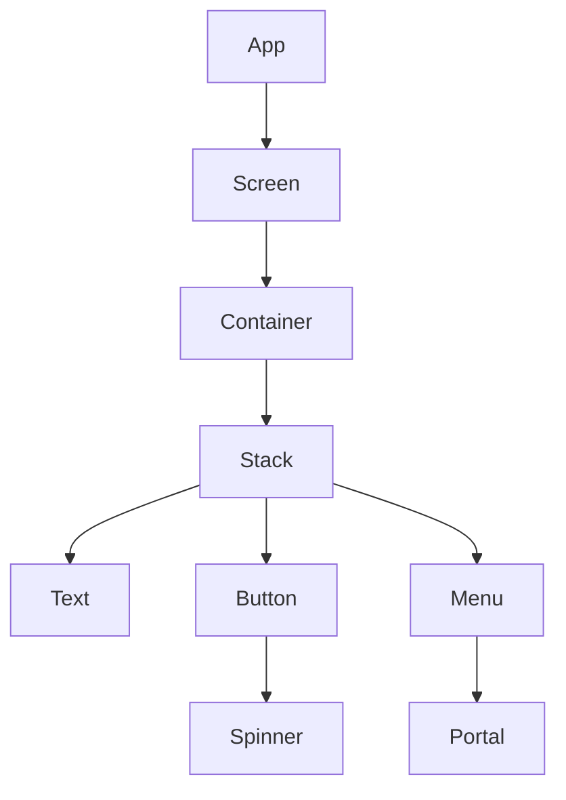

# UI Primitives

Blue Ocean builds screens from a small set of composable primitives located in `src/ui/primitives`.
These components wrap React Native elements and provide a consistent design system.

- **Screen / Container / Stack** – layout primitives used to structure pages.
- **Text** – typography wrapper that reads theme colors.
- **Button & Spinner** – interactive controls and loading states.
- **Menu & Portal** – overlay utilities for dropdowns and dialogs.

These primitives form the foundation for higher‑level features throughout the app.
